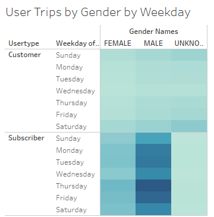

# Bike Sharing Analysis.
 
## Introduction
The purpose of this analysis is to help understand when and for how long individuals are using bikes. Seeing if there are any differences in gender and any other key factors that may become present.
 
## Results
Here are the results that we were able to conclude:
 [link to dashboard](https://public.tableau.com/app/profile/jahid.miah/viz/BikeTripAnalysis_16564779480090/Story1?publish=yes)
 

Description: This graph depicts the average time each user spent using the bike.
 

Description: This graph depicts the average time by gender each user spent using the bike.
 

Description: This graph shows us the relative activity level during any given time of the week.
 

Description:This graph shows us the relative activity level based on gender during any given time of the week.
 

Description: This Graph shows if there's a difference in user based between customers and subscribers.
 
## Summary
Based on the results, we can see that most individuals only ride directly before in the early morning hours and the early evening hours. This could explain that many of the users may be using the bikes to get to and from work. This explains why we have such high subscriber counts as well as the timeframe that individuals come in. In the Trips by Weekday per Hour graph we can see that during the mid afternoon on friday we do have an uptake in the number of users. This may be due to an influx of tourists. One thing to note is that there are more male users than female users but the average trend lines seem to be relatively the same, meaning the use cases must be similar to identical.
