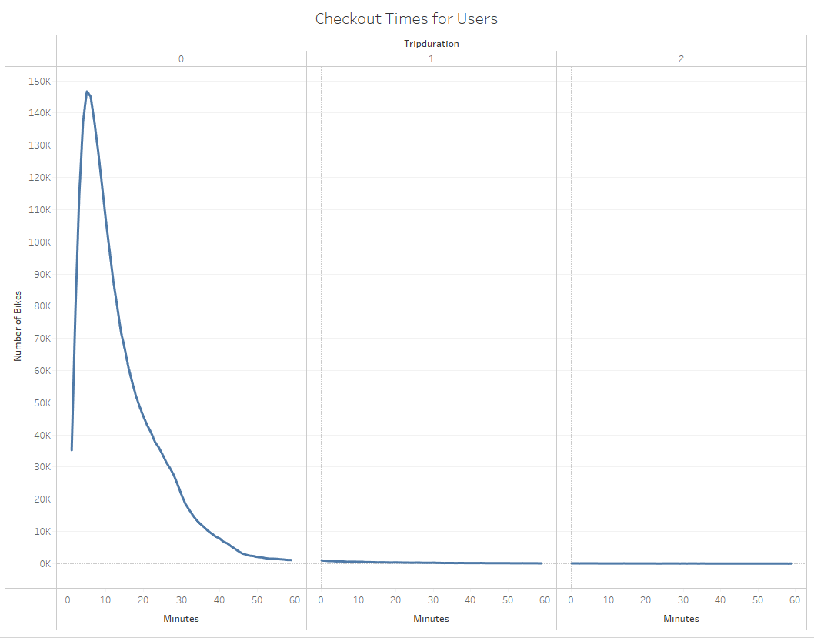

# Bike Sharing Analysis. 
 
 
## Introduction
The purpose of this analysis is to help understand when and for how long indiviudals are using bikes. Seeing if there is any diffrences in gender and any other key factors that may become present. 
 
## Results
Here are the results that we were able to conclude:
 [link to dashboard](https://public.tableau.com/app/profile/jahid.miah/viz/BikeTripAnalysis_16564779480090/Story1?publish=yes)

## Summary
Based on the information we gathered, we can conclude that the nine graders at THS did not show any indication of academic dishonesty. The school has an overall high test score compared to other schools in the district. Arguably speaking, considering ninth grade should be easier then the higher grade levels the subtle dip in passing grades is not significant. There could be many outside forces that can affect such a small change. If more due diligence is needed on this topic, we should drop all ninth graders in the district to see if that drops the statistics. If so then we may have a case of academic dishonesty, if not, this analysis has concluded that the ninth graders in THS were not academically dishonest.